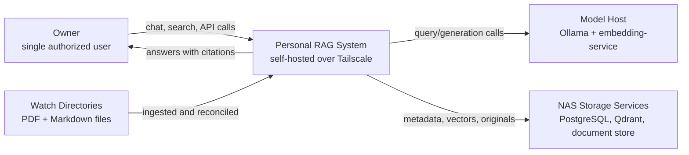

# C4 Level 1: System Context

This diagram shows the system boundary, external actors, and high-level information flows.

## System Diagram

## System Description

**Interactive Query Path:**
The owner sends chat or search requests to the API service. The system embeds the query, retrieves candidate chunks from the vector and sparse indexes, applies answerability checks, and streams generated answers from the local LLM when sufficient grounding exists.

**Ingestion Path:**
The ingestion worker scans configured watch directories, treats them as the authoritative corpus, copies originals into the managed document store, chunks supported documents, embeds chunks, and indexes them.

**Key Characteristics:**

- **Single-user and private** — reachable only over Tailscale/private network with API key protection.
- **Self-hosted** — no managed cloud services are assumed.
- **Dockerized services** — API, ingestion, embedding, vector store, metadata store, and model-serving components are independently deployable.
- **Conservative generation** — weak retrieval should produce refusal rather than speculation.

For detailed component breakdown and interactions, see [C4 Level 2: Containers](c4-level-2.md).
