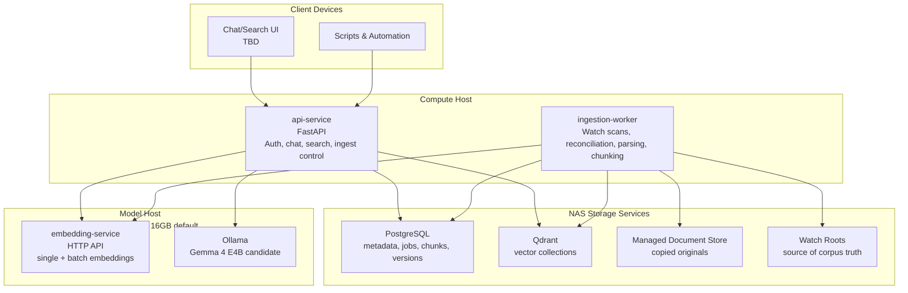

# C4 Level 2: Container Diagram

The system decomposes into Docker services and storage components organized by operational concern.

## API and Interactive Query

| Component | Type | Purpose |
|-----------|------|---------|
| **api-service** | Service | Exposes chat, search, document, and ingestion-control endpoints. Owns API key auth, retrieval orchestration, answerability checks, and streaming generation. |
| **embedding-service** | Service | Produces query embeddings for interactive retrieval and batch embeddings for ingestion. |
| **Ollama** | Model server | Hosts the local generation model. Gemma 4 E4B is the current candidate, but model choice is configuration. |

**Related Decisions**

| Type | Reference | Details |
|------|-----------|---------|
| **ADR** | [003: Service Boundaries](../adr/003-service-boundaries.md) | API and ingestion split, retrieval/generation initially internal to API |
| **ADR** | [004: Embedding Service](../adr/004-embedding-service.md) | Dedicated embedding service and default model-host placement |
| **ADR** | [007: Retrieval and Answerability](../adr/007-retrieval-and-answerability.md) | Hybrid retrieval, citations, and refusal gates |

---

## Ingestion

| Component | Type | Purpose |
|-----------|------|---------|
| **ingestion-worker** | Worker service | Claims ingestion jobs, scans watch roots, reconciles additions/updates/deletions, parses documents, chunks text, embeds chunks, and writes indexes. |
| **Watch roots** | Filesystem source | Authoritative source of corpus membership. |
| **Managed document store** | File storage | Keeps copied originals for reprocessing and auditability. |

**Related Decisions**

| Type | Reference | Details |
|------|-----------|---------|
| **ADR** | [001: Data Sources and Ingestion](../adr/001-data-sources-and-ingestion.md) | Supported formats, watch roots, ingestion triggers, deletion handling |
| **ADR** | [005: Document Identity and Ingestion State](../adr/005-document-identity-and-ingestion-state.md) | Immutable document versions and persisted ingestion state |
| **ADR** | [006: Chunking Strategy](../adr/006-chunking-strategy.md) | Structure-aware chunking and citation metadata |
| **ADR** | [008: Job Coordination and Service Contracts](../adr/008-job-coordination-and-service-contracts.md) | PostgreSQL-backed job coordination |

---

## Storage

| Component | Type | Purpose |
|-----------|------|---------|
| **PostgreSQL** | Database | Central metadata store for documents, versions, source paths, chunks, jobs, and lifecycle state. |
| **Qdrant** | Vector store | Stores chunk embeddings and vector-search payloads. Defaults to NAS placement but is movable by URL. |
| **Managed document store** | File store | Stores original document copies using stable internal IDs. |

**Related Decisions**

| Type | Reference | Details |
|------|-----------|---------|
| **ADR** | [002: Storage and Metadata Topology](../adr/002-storage-and-metadata-topology.md) | PostgreSQL on NAS and Qdrant as movable Docker service |
