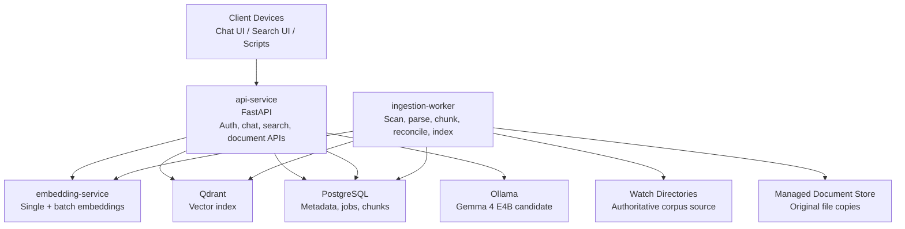

# Architecture

## About This System

This project is a personal, self-hosted Retrieval-Augmented Generation system. It is designed for two purposes:

**[View ADRs](../adr/index.md)**

- **Personal utility** — a private knowledge retrieval and question-answering system for the owner.
- **Portfolio demonstration** — a clean, documented reference implementation that shows practical architecture and engineering trade-offs.
- **Local-first operation** — all core services run on owner-controlled machines over a private Tailscale network.
- **Dockerized services** — components are packaged independently so compute and storage workloads can be moved between machines.

**Current State:** Architecture and documentation scaffold. Implementation is ready to begin from the accepted ADRs.

---

## Design Intent

### 1. File-System Corpus Ownership

**Principle:** Configured watch directories define corpus membership.

**Why:** The owner should be able to reason about the corpus using normal file workflows: if a supported file is in the watch directory, it belongs in RAG; if it is removed, reconciliation removes it from the index after watch-root health checks.

**Related Decision:** [ADR 001 — Data Sources and Ingestion](../adr/001-data-sources-and-ingestion.md)

### 2. Movable Services, Central Data

**Principle:** Services are Dockerized and addressed by configuration; durable data services default to NAS placement.

**Why:** The owner wants to move services between machines without redesigning the application. PostgreSQL, Qdrant, and the managed document store are central by default, while model-serving and compute-heavy services can move if performance requires it.

**Related Decision:** [ADR 002 — Storage and Metadata Topology](../adr/002-storage-and-metadata-topology.md)

### 3. Conservative Answering

**Principle:** No answer is preferred over a wrong answer.

**Why:** A personal knowledge assistant loses value if it confidently invents facts. Retrieval quality, answerability gates, and citations are first-class parts of the architecture.

**Related Decision:** [ADR 007 — Retrieval and Answerability](../adr/007-retrieval-and-answerability.md)

---

## System Shape

## C4 Model Levels

- **[C4 Level 1: System Context](c4-level-1.md)** — System boundaries, external actors, and high-level information flows.
- **[C4 Level 2: Containers](c4-level-2.md)** — Major services, databases, model hosts, and interaction paths.
